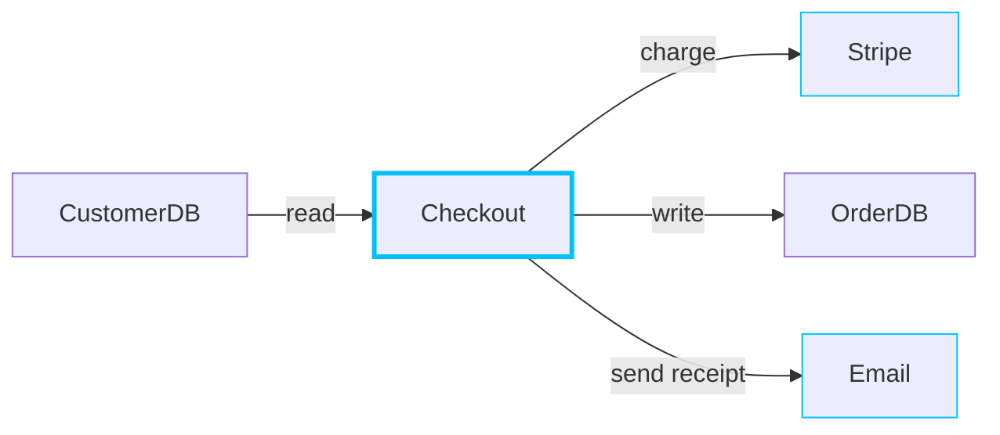
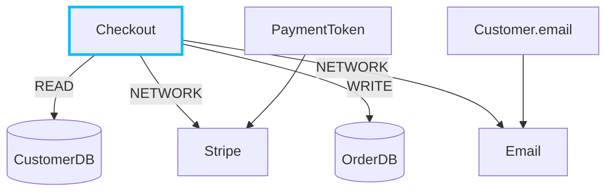
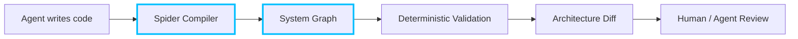

# 🕷️ Spider

<p align="center">
  
</p>

<p align="center">
  <strong>A programming language designed for agent-generated software.</strong>
</p>

<p align="center">
  Deterministic workflows · Static effects · Information flow · Offline validation
</p>

---

## Why Spider?

AI agents can generate code much faster than humans can review it.

Spider explores a different model: **make generated software mechanically understandable.**

Instead of compiling only into an executable, Spider produces a deterministic **System Graph** describing how the application behaves:



The graph can be inspected and validated **without executing the application or asking an LLM to interpret the codebase.**

## The Idea

Traditional compilers primarily validate things like syntax and types.

Spider extends the model:

```text
Types
  +
Effects
  +
Capabilities
  +
Information Flow
  +
Workflow Topology
  ↓
Deterministic System Graph
```

A workflow might look like:

```text
workflow Checkout(req: CheckoutRequest) -> Receipt
    reads CustomerDB
    writes OrderDB
    network Stripe, Email
{
    customer = CustomerDB.get(req.customer_id)
    payment = Stripe.charge(req.payment_token, req.amount)

    order = OrderDB.save(customer, payment)

    Email.send(customer.email, receipt(order))

    return receipt(order)
}
```

Spider can then deterministically derive:



## Offline Analysis

The compiler-generated graph makes architectural questions directly queryable:

```bash
spider effects Checkout
spider writers OrderDB
spider trace Customer.email
spider path Customer.email External
spider external
spider validate
spider diff main feature
```

For example:

```text
$ spider trace Customer.email

Customer.email
    ↓
Checkout
    ↓
Email.send
    ↓
External<Email>
```

## Architecture as Code

Spider is intended to support system-level constraints:

```text
architecture {
    deny Secret -> External

    allow PaymentToken -> Stripe

    deny Personal -> Analytics

    only Billing can write PaymentLedger

    deny Unknown
}
```

If an agent introduces:

```text
Analytics.send(customer.email)
```

Spider should reject it with the actual path:

```text
SPIDER E403 — Illegal Data Flow

Customer.email
    ↓
Checkout
    ↓
Analytics.send
    ↓
External<Analytics>

Violation:
    deny Personal -> Analytics
```

## Agent-Native Development

The goal is to move code review from:

```text
Agent writes 50,000 lines
        ↓
Human reads 50,000 lines
```

toward:



Humans and agents can inspect **what changed in the system** before diving into implementation details.

## Status

🚧 **Spider is experimental.**

The first prototype is focused on proving the core model:

- Human-readable language
- Static type checking
- Effect propagation
- Capabilities
- Information-flow tracking
- Deterministic System IR
- Workflow graph generation
- Offline graph queries
- Architecture policies
- Architecture diffs

The compiler/tooling is being prototyped in **Rust**.

## Philosophy

> Code generation is becoming cheap. Verification is becoming the bottleneck.

Spider is an experiment in designing a programming language around that new constraint.

If behavior cannot be represented in Spider's deterministic system graph, strict workflows should not silently treat that behavior as safe.

## Repository Structure

```text
spider/
├── crates/
│   ├── lexer/
│   ├── parser/
│   ├── ast/
│   ├── types/
│   ├── effects/
│   ├── ir/
│   ├── graph/
│   ├── policy/
│   ├── query/
│   └── cli/
├── examples/
├── tests/
├── assets/
│   └── spider-logo.png
├── LICENSE
└── README.md
```

## Contributing

Spider is at an early experimental stage.

Issues, language-design discussions, compiler experiments, and pull requests are welcome.

## License

Licensed under the **Apache License 2.0**.

See `LICENSE` for details.

---

<p align="center">
  <strong>Spider</strong><br>
  Build the code. Map the system. Verify the behavior.
</p>
